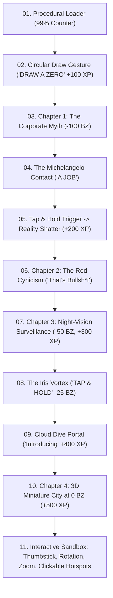

# Zero University Teardown & Interactive Architecture Blueprint

> **Reference URL:** [https://why.zero.university/](https://why.zero.university/)  
> **Target Application:** Noel Raterta Jr. (Spade-kun) Engineering Portfolio  
> **Document Purpose:** Complete architectural teardown, interaction mechanics analysis, and practical implementation ideas for future portfolio enhancements.

---

## 1. Executive Summary & Core Philosophy

[why.zero.university](https://why.zero.university/) is an elite Awwwards Site-of-the-Day caliber WebGL scrollytelling experience designed around **gamified interactive gates**, **dramatic atmospheric shifts**, and a **3D isometric sandbox**.

Rather than treating portfolio storytelling as passive vertical text and card scrolling, Zero University turns the viewer into an **active participant**. Progression is earned through physical gestures, tap-and-hold interactions, and timeline exploration, rewarding users with real-time **XP points**.

---

## 2. Full Narrative & Interactive Breakdown

### Stage 1: The Gesture Lock ("DRAW A ZERO")
* **Initial State:** Radial gradient background (`#1C4839` deep pine green) with an embossed counter that renders instantly while WebGL shaders boot.
* **The Interaction:** The user is met with a floating hand cursor and a glowing particle trajectory orbiting the center island. A status badge displays `DRAW A ZERO`.
* **Unlock Mechanic:** Moving the cursor in a circular motion around the center coordinates triggers particle convergence, unlocks the audio engine, and awards **`100 XP`** in the top-right HUD.

---

### Stage 2: The Corporate Myth (`-100 BZ`)
* **Visuals:** A green humanoid/alien hand reaches outward from an aqua glow. Floating, rotating 3D medallions featuring big-tech corporate emblems (Apple, Amazon, Microsoft, Netflix, Tesla) drift around the fingers.
* **Typography:** Elegant high-contrast serif typography reads: *"You Believed College would land You..."*
* **The Climax:** As the user scrolls, the hand approaches a human hand in a classical meadow framed by Roman stone columns and falling pink flower petals, concluding with *"A JOB"*.

---

### Stage 3: The Reality Shatter (`-75 BZ`)
* **Interactive Trigger:** A glowing circular target appears directly between the two fingertips with a pulsing label: **`TAP & HOLD`**.
* **Action:** Pressing and holding for ~3 seconds fills the ring gauge, triggering a glass-shattering sound and visual burst.
* **Atmospheric Shift:** The peaceful green meadow violently shatters. The entire lighting environment switches instantly to high-contrast crimson red.
* **The Punchline:** Large, aggressive editorial typography cuts through: **"That's Bullsh*t"**, while a human arm extends upward from below surrounded by floating glass shards. Awards **`200 XP`**.

---

### Stage 4: The Surveillance & Need to Exist (`-50 BZ` to `-25 BZ`)
* **Atmosphere:** Deep analog CRT static, heavy film grain, and a green-phosphor circular peephole lens.
* **Narrative:** *"and that's Why we had to Exist"*.
* **The Gate:** At `-25 BZ`, a rotating iris aperture made of green metallic petals forms a swirling particle vortex in the center with a second **`TAP & HOLD`** prompt.
* **Outcome:** Holding the vortex charges the core, jumps the counter to **`400 XP`**, and triggers an aerial camera dive through a cloud layer.

---

### Stage 5: The Miniature Tech Metropolis (`0 BZ`)
* **Reward:** Hitting `0 BZ` awards **`500 XP`** and drops the user into an open-world 3D miniature city.
* **Interactive Sandbox Features:**
  1. **Virtual Thumbstick (Bottom-Left):** Draggable joystick allowing smooth 2D camera panning across the isometric city grid.
  2. **Camera Controls (Bottom-Right):** Dedicated buttons for Zoom In (`+`), Zoom Out (`-`), and left/right orbital rotation (`◄`, `►`).
  3. **Company Landmarks & Easter Eggs:**
     - OpenAI twisting helix tower
     - Apple spaceship circular campus
     - McDonald's oversized French Fries carton building
     - Nintendo building crowned with a glowing Super Mario Invincibility Star
     - SpaceX Falcon rocket and launch tower
     - Stripe skyscraper, Netflix tower, Amazon dome, Tesla spire
  4. **Clickable Hotspots:** Pulsing white beacon dots placed atop key structures to view specific company details.
  5. **Holographic Center Beacon:** A rotating green laser cylinder reading *"JOIN THE WAITLIST"* around the main arena.
  6. **Bottom Dock:** Floating frosted glass pill featuring audio toggle, chapter navigation, and hamburger menu (`Home`, `Letters`, `Why Zero`).

---

## 3. Core Technical Architecture & Under-the-Hood Tricks

| Technique | Implementation Details | Why It Works |
| :--- | :--- | :--- |
| **Instant First-Paint** | A static `#bg-gradient` div and `#pre-canvas-99` number rendered in raw CSS before Three.js/WebGL initializes. | Eliminates blank white screen flashes during heavy 3D asset initialization. |
| **Virtual Scroll Trapping** | `overflow: hidden` on `<body>` with custom `wheel` and pointer event listeners updating a global timeline parameter ($t \in [-100, 0]$). | Prevents native browser scroll stutter and guarantees frame-perfect scrubbing through 3D camera animations. |
| **Gesture Recognition** | Vector tracking of pointer deltas relative to a center point $(x_c, y_c)$. Completing a $2\pi$ radial sweep triggers the state machine unlock. | Forces viewer engagement within the first 3 seconds of arrival. |
| **Hold-to-Confirm Timers** | Continuous `pointerdown` measuring time threshold ($t \ge 3000\text{ms}$) with dynamic SVG circle stroke offset animation. | Builds tactile tension before high-impact visual reveals. |
| **Altimeter Ruler Timeline** | A top-mounted tick mark ruler replacing the traditional scrollbar. Numbers scrub from `-100 BZ` to `0 BZ`. | Reinforces the worldbuilding concept without looking like a generic web page. |
| **Web Audio Soundscape** | Synthesized spatial audio effects tied directly to hover, scroll velocity, gesture completion, and hold releases. | Multi-sensory immersion that heightens aesthetic value. |

---

## 4. How to Adapt These Concepts into Spade-kun's Portfolio

To respect intellectual property while achieving the same level of wow-factor, here is how we can translate these concepts into Noel's unique brand identity (**High-Performance Engineering, Cyber Systems Architecture, n8n Automation & Databases**):

### Idea A: Terminal Overclock & Neural Boot Gesture
* **Instead of "Draw a Zero":** A futuristic terminal boot sequence where the user must **"DRAG TO CONNECT THE POWER CIRCUIT"** or trace a circuit bridge between two glowing data pins.
* **Reward:** Unlocks the terminal grid, triggers a subtle boot chime, and sets **Engineering Level / XP** to 100.

### Idea B: The "Dual-Mode" Reality Shift
* We already implemented the **Systems Topology Graph** and **Editorial Timeline** toggle in the Experience section.
* **Future Upgrade:** Add a dramatic **"OVERCLOCK / AUDIT MODE"** switch in the navigation bar. When toggled (or held):
  - Screen flashes with subtle green/amber CRT phosphor scanlines.
  - The UI peels back to show the live backend metrics, API response speeds, node connection matrices, and relational query plans behind Noel's projects.

### Idea C: Interactive Architecture Sandbox (The "Spade-kun Engine Room")
* **Instead of a 3D City:** An interactive **Isometric Systems Server Farm / Architecture Diagram**:
  - Mini rack units representing PostgreSQL, Redis, n8n Automation Nodes, Next.js Edge Servers, and API Gateways.
  - Virtual panning thumbstick or drag-to-orbit controls.
  - Clicking on a server rack opens its real architecture blueprint, latency benchmarks, and code implementation.

### Idea D: Recruiter XP & Secret Achievements
* Award small badges/XP for exploring deep sections:
  - `+50 XP`: Inspected Systems Topology Graph.
  - `+100 XP`: Opened Live Terminal Console (`~` or `F12` interactive panel).
  - `+150 XP`: Completed full timeline scrub.
  - Reaching `500 XP` unlocks a direct one-click **"Priority Interview Request"** or downloadable verified engineering dossier.

---

## 5. Visual Artifact Reference

Captured reference frames from the teardown are preserved in the workspace directory under `.playwright-mcp/` and artifact storage for reference when designing 3D scenes, shaders, and interaction hooks.
